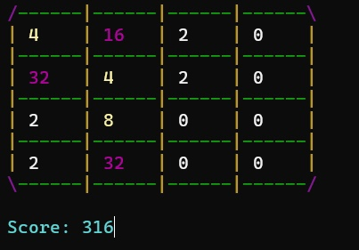
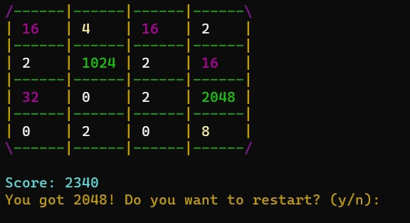

# 2048.cpp
>Terminal version of the game "2048"
>
>Run the exe file to play

<h3>program example</h3>

  <ul padding-left: 0;>
    <li list-style-type: none; ></li>
    <li list-style-type: none;></li>
    <li list-style-type: none;></li>
  </ul>

