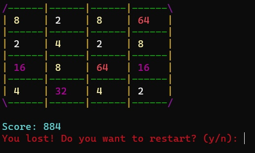

# 2048.cpp
>Terminal version of the game "2048"
>>Run the exe file to play

<h2>program example</h2>

  <ul>
    <li list-style-type: none;></li>
    <li list-style-type: none;></li>
    <li list-style-type: none;></li>
  </ul>

